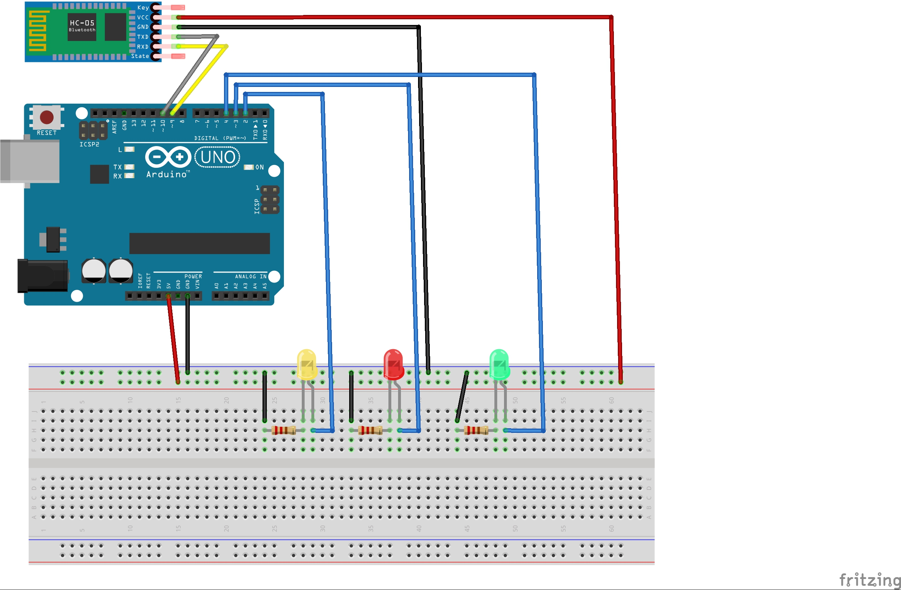

# Bluetooth-Leds

## Connections

## How to

You ought to connect via bluetooth to the Arduino, in this case the HC-05 is used.
Then, if you pair it with a phone, and open a remote terminal in there, you can send commands to it, for example:

- **Y** -> Turns the Yellow led on.
- **R** -> Turns the Red led on.
- **G** -> Turns the Green led on.
- **P** -> A very simple Pattern with the leds :D
