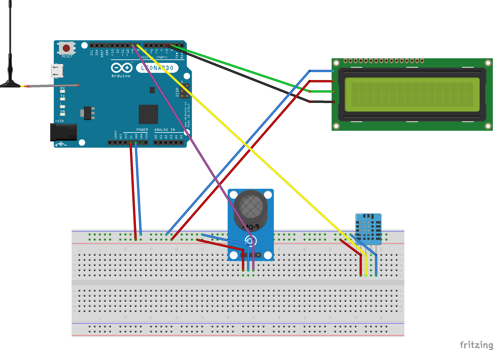

# Wifi Connection

## Connections

## Summary
This is an example where an Arduino Leonardo connects to an external TCP Server via WiFi and sends information, like temperature, humidity and a boolean indicating the presence of Ethanol in air. A LCD Screen is used to notify the progress.
